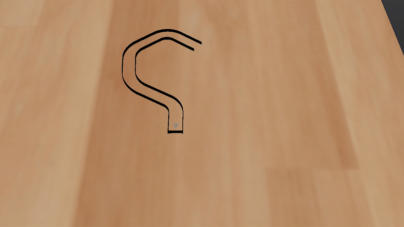

# Curriculum-based Navigation in Tunnels using Proportional and Evolutionary Controllers

## Table of Contents

- [Abstract](#abstract)
- [Experimental Videos](#experimental-videos)
- [Methodology & Architecture](#methodology--architecture)
- [Simulation Environment](#simulation-environment)
- [Curriculum Stages](#curriculum-stages)
- [How to Run](#how-to-run)
- [Results](#results)
- [Code and Models](#code-and-models)
- [Future Work](#future-work)
- [References](#references)
- [Authors](#authors)

---

## Abstract

This project presents an autonomous navigation system for a differential-drive robot in procedurally generated tunnel environments using the Webots simulator.  
Three controllers are developed and compared:

1. **Classical P Controller** – a reactive wall-following controller with fixed proportional gains.  
2. **GA-tuned P Controller** – a steady-state Genetic Algorithm that evolves the proportional gains of the P controller for better adaptability.  
3. **Neuroevolutionary MLP Controller** – a feedforward neural network optimized through a steady-state Genetic Algorithm, directly mapping LiDAR readings to velocity commands.

The evaluation follows a **curriculum learning** strategy, progressively increasing difficulty by adding curves, increasing turning angles, and reducing tunnel clearance.  
For evolutionary controllers (GA-tuned P and NE MLP), each individual is evaluated on **10 maps** per generation (5 from the current stage and 5 from previous ones), promoting robustness and avoiding catastrophic forgetting.  
Results show that the neuroevolutionary controller achieves the highest generalization and robustness across all stages.

### Controllers Flowchart:

  

**Figure —** End-to-end pipeline for the three controllers.  

---

## Experimental Videos

A complete set of simulation videos is available in the following YouTube playlist:  
[**Experimental Navigation Videos – All Controllers and Stages**](https://youtube.com/playlist?list=PLnGn2mxZoUm01cfsoQyloDOIwU6e5aFNk&si=2u6m7A_xj82vU8XH)  

This playlist includes demonstrations of all three controllers — **Classical P Controller**, **GA-tuned P Controller**, and **Neuroevolutionary MLP Controller** — across all curriculum stages and different LiDAR field-of-view configurations (**Full FOV**, **Left FOV**, **Right FOV**).  
To improve visual clarity and reduce viewing time, all video simulations are shown at 2× playback speed.

Here are some short demonstrations from the simulations:

  
  
  

---

## Methodology & Architecture
- **Classical P Controller:** Wall-following with fixed proportional gains for distance and orientation.
- **GA-tuned P Controller:** Evolves proportional gains using a steady-state Genetic Algorithm.
- **Neuroevolutionary Controller:** MLP mapping LiDAR inputs to velocities, optimized via GA.

  - Neuroevolutionary Controller Architecture:

  

*Figure —* MLP mapping LiDAR readings to motor commands, optimized via Genetic Algorithm.

---

## Simulation Environment

- **Simulator:** Webots R2023a  
- **Robot:** e-puck differential-drive robot  
- **Sensors:**  
  - LiDAR (201 rays, covering −76° to +76° field of view)  
  - Touch sensor for collision detection  
- **Map Generation:**  
  - Procedural tunnels defined by:  
    - Number of curves  
    - Curve angle range  
    - Clearance factor (tunnel width / robot diameter)  
  - Obstacles disabled in current experiments (reserved for future work).  
- **Physics & Constraints:**  
  - Robot radius: 0.035 m  
  - Velocity range: 0.08–0.18 m/s (controller-dependent in practice)  
  - Timeout triggers for inactivity or max simulation time.

---

## Curriculum Stages

Defined in `configuration.py` under `STAGE_DEFINITIONS`:

- **Stages 0–10:** Gradual increase in curve count and turning angles, maintaining wide clearance.  
- **Stages 11–15:** Maintain curve complexity while reducing clearance factor.  
- **Parameters per stage:**  
  - `num_curves` — number of curves in the tunnel.  
  - `main_angle_range` — range of main curve angles.  
  - `clearance_factor` — ratio between tunnel width and robot diameter.  
  - `num_obstacles` — number of obstacles (0 in this version).

---

## Future Work

- Introduce obstacles into tunnels to assess controller adaptability.  
- Explore GA parameters (population size, mutation rate) to optimize performance.  
- Transfer controllers to physical robots to evaluate real-world robustness.

---

## References

1. J. Larsson, M. Broxvall, and A. Saffiotti, “Laser-based corridor detection for reactive navigation,” *Industrial Robot*, vol. 35, no. 1, pp. 69–79, 2008.  
2. M. T. Ohradzansky and J. S. Humbert, “Lidar-based navigation of subterranean environments using bio-inspired wide-field integration of nearness,” *Sensors*, vol. 22, no. 3, p. 849, 2022.  
3. T. Yata, L. Kleeman, and S. Yuta, “Wall following using angle information measured by a single ultrasonic transducer,” in *Proceedings of the 1998 IEEE International Conference on Robotics and Automation (ICRA)*, vol. 2, pp. 1590–1596, 1998.  
4. H. Suwoyo, Y. Tian, C. Deng, and A. Adriansyah, “Improving a wall-following robot performance with a PID-genetic algorithm controller,” in *2018 5th International Conference on Electrical Engineering, Computer Science and Informatics (EECSI)*, pp. 314–318, 2018.  
5. F. Mondada, M. Bonani, X. Raemy, J. Pugh, C. Cianci, A. Klaptocz, S. Magnenat, J.-C. Zufferey, D. Floreano, A. Martinoli et al., “The e-puck, a robot designed for education in engineering,” in *IEEE International Conference on Autonomous Robot Systems and Competitions (ICARSC)*, vol. 1, no. 1, pp. 59–65, 2009.  
6. O. Michel, “Cyberbotics ltd. Webots: Professional mobile robot simulation,” *International Journal of Advanced Robotic Systems*, vol. 1, no. 1, pp. 39–42, 2004.  
7. S. Yang, M. Meng, and X. Chen, “Design and implementation of a fuzzy wall-following controller for mobile robots,” *IEEE Transactions on Industrial Electronics*, vol. 51, no. 2, pp. 491–495, 2004.  
8. M. Mucientes, D. L. Moreno, A. Bugarín, and S. Barro, “Evolutionary learning of a fuzzy controller for wall-following behavior in mobile robotics,” *Soft Computing*, vol. 10, no. 10, pp. 881–889, 2006.  
9. G. Leão, F. Almeida, E. Trigo, H. Ferreira, A. Sousa, and L. P. Reis, “Using deep reinforcement learning for navigation in simulated hallways,” in *IEEE International Conference on Autonomous Robot Systems and Competitions (ICARSC)*, pp. 207–213, 2023.  
10. T. Fonseca, G. Leão, L. L. Ferreira, A. Sousa, R. Severino, and L. P. Reis, “Multi-agent reinforcement learning for side-by-side navigation of autonomous wheelchairs,” in *IEEE International Conference on Autonomous Robot Systems and Competitions (ICARSC)*, pp. 138–143, 2024.  
11. J. Tu and S. X. Yang, “Genetic algorithm based path planning for a mobile robot,” in *IEEE International Conference on Robotics and Automation (ICRA)*, vol. 1, pp. 1221–1226, 2003.  
12. D. Floreano and F. Mondada, “Evolution of homing navigation in a real mobile robot,” *IEEE Transactions on Systems, Man, and Cybernetics, Part B (Cybernetics)*, vol. 26, no. 3, pp. 396–407, 1996.  
13. X. Zou, E. Scott, A. Johnson, K. Chen, D. Nitz, K. De Jong, and J. Krichmar, “Neuroevolution of a recurrent neural network for spatial and working memory in a simulated robotic environment,” in *Genetic and Evolutionary Computation Conference (GECCO) Companion*, pp. 289–290, 2021.  
14. K. Hasselmann, A. Ligot, J. Ruddick, and M. Birattari, “Empirical assessment and comparison of neuro-evolutionary methods for the automatic off-line design of robot swarms,” *Nature Communications*, vol. 12, p. 3456, 2021.  
15. B. Santos, A. Cardoso, G. Leão, L. P. Reis, and A. Sousa, “Hierarchical reinforcement learning and evolution strategies for cooperative robotic soccer,” in *Iberian Robotics Conference (ROBOT)*, pp. 1–6, 2024.  
16. L. Marzari, D. Corsi, E. Marchesini, and A. Farinelli, “Curriculum learning for safe mapless navigation,” in *Proceedings of the 37th ACM/SIGAPP Symposium on Applied Computing*, pp. 766–769, 2022.  
17. R. Brooks, “A robust layered control system for a mobile robot,” *IEEE Journal on Robotics and Automation*, vol. 2, no. 1, pp. 14–23, 1986.  

---

## Authors

- **Alejandro Gonçalves** – Faculty of Science, University of Porto (FCUP)  
- **Francisca Mihalache** – Faculty of Science, University of Porto (FCUP)  
- **João Sousa** – Faculty of Science, University of Porto (FCUP)  
- **Gonçalo Leão** – Faculty of Engineering, University of Porto (FEUP)  
- **Luís Paulo Reis** – Faculty of Engineering, University of Porto (FEUP)  
